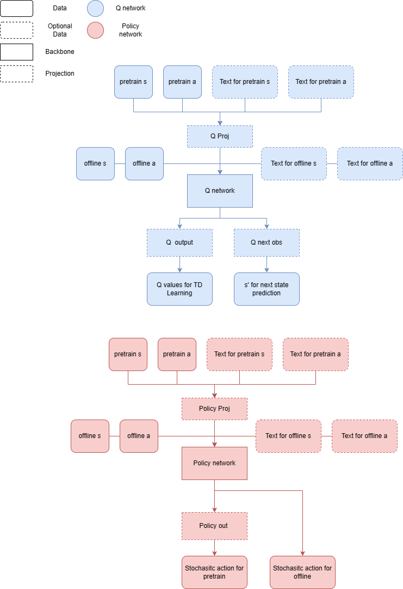

#   Cross Pretraining with Projections and Text Embeddings

*   The scripts in this directory serve to test and run experiments for cross-environment learning. `crosspre_test.sh` is the sbatch file for testing purposes, `crosspre.sh` is the sbatch file running the default set of experiments.
*   Before submitting the jobs, check the comments in the `.py` files which document the usage of various hyperparameters and modify if needed.
*   After modifying the `.py` files, modify the `.sh` files as follows:
>   *   Change resource usage and HPC specific arguments if needed
>   *   Calculate the total number of tasks for the experiments in the `.py` file in the job array argument
>   *   You need to make sure the directory for output and error logs exist
>   *   For the Singularity `-B` arguments, modify so that the paths point to those in your specific case
*   Run the `.sh` files by `sbatch crosspre.sh` or `sbatch crosspre_test.sh` for debugging
*   A simplified diagram of the architecture of the q and policy networks can be found here: 
